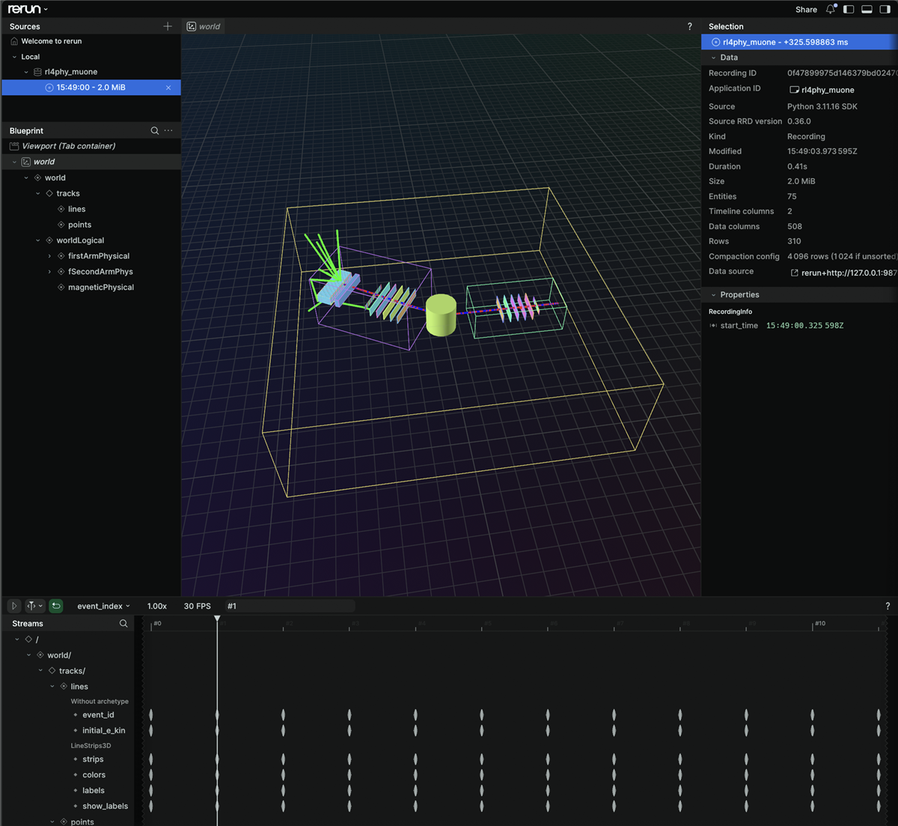
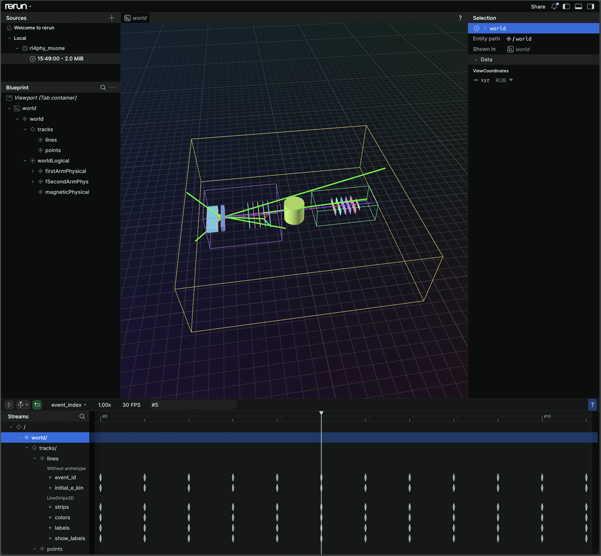
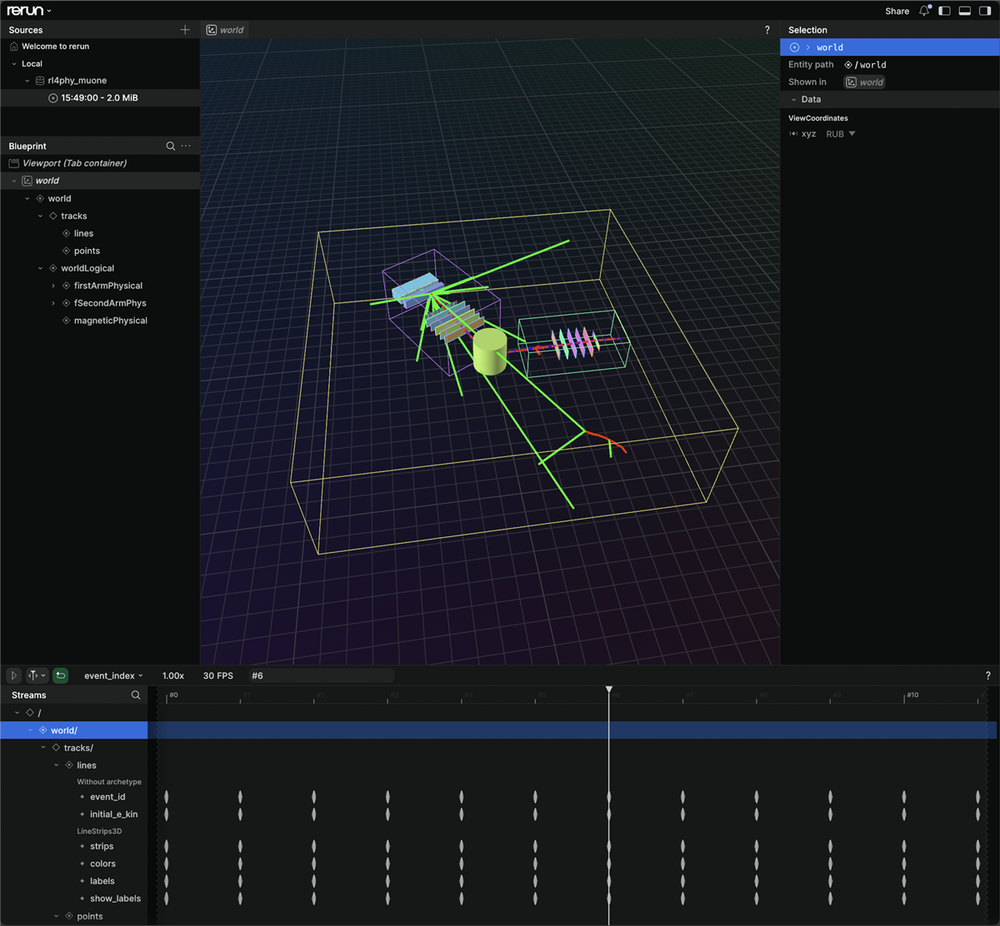

# Connecting Geant4 examples to RL4PHYS (gRPC)

How to add a Geant4 example so that it runs exactly as upstream wrote it and
streams its results over gRPC to the Python receiver, which draws them in Rerun.
**B1** and **B5** at the end are this guide applied.

## What an integration consists of

| What | Where it comes from | What it costs you |
|------|---------------------|-------------------|
| the example's own scoring | whatever the example already computes | a message in `proto/rl4phy.proto`, a `Send…()` in `commons/GrpcClient.hh`, a branch in `python/server.py` |
| the geometry | `commons/GeometryExport.hh` | one call in `BeginOfRunAction` |
| the trajectories | `commons/TrajectoryStream.hh` | one call in `main`, one in `EndOfEventAction` |

Three rules always hold:

- Geant4 runs **exactly like the original example** — same physics, same scoring,
  same console output.
- The vendored example directory stays **byte-for-byte upstream**.
- Everything we add lives in one file beside it, `<Name>_rl4phys.cc`.

## Rule one: subclass, never edit

The integration subclasses the example's user actions in `<Name>_rl4phys.cc` and
never touches `<Name>/`. Two reasons:

- the copy in the repo can be diffed against the upstream release at any time;
- a newer Geant4 drops in as a copy, not a merge — what breaks is our one file,
  at compile time.

Every override calls the base class first, then adds the gRPC part:

```cpp
void EndOfEventAction(const G4Event* event) override
{
  EventAction::EndOfEventAction(event);   // the example's own end of event
  // ... ours
}
```

The order matters: B5's `EndOfEventAction` is what fills the histograms and the
per-cell energies, so our data only exists after that call.

If the base class keeps a value private, read it back through a public getter
(B5: `GetEmCalEdep()`), or recompute it in the subclass (B1 mirrors `fEdep`; B5
looks the hit collection Ids up again). Either way the numbers are checked
against the example's own printed output — see [Verifying](#verifying).

## What `commons/` gives you

Three headers, on every example's include path. Details in
`geant4/commons/README.md`; below is what you need to write an example.

| Header | What it is for | The calls that matter |
|--------|----------------|-----------------------|
| `GrpcClient.hh` | the wire | `SendEventScoring`, `SendB5Event`, `SendTrajectories`, `SendGeometry` |
| `GeometryExport.hh` | the detector | `SendForRun`, `WriteToFile` |
| `TrajectoryStream.hh` | the tracks | `Enable`, `SendEvent` |

### `GrpcClient.hh` — the wire

```cpp
explicit GrpcClient(std::shared_ptr<grpc::Channel> channel);

void SendEventScoring(float edep_MeV, int event_id);
void SendStepHit(const rl4phys::StepHit& hit);
void SendB5Event(const rl4phys::B5Event& event);
void SendTrajectories(const rl4phys::EventTrajectories& trajectories);
bool SendGeometry(const std::string& gdmlContent);
```

Examples hold no protobuf stub of their own; a new payload gets a
`Send<Payload>()` here. Two ownership rules:

- **One client per thread.** The channel is shared, the client is not. `main`
  creates the channel, each action object builds its own client — and `Build()`
  runs once per worker thread, so that is one client per thread by construction.
- **The client outlives the run.** `SendGeometry` waits up to 30 s for the
  receiver on the first failure and never again, but the latch is a member of the
  client, so a fresh client per run pays the 30 s again every run. Hold the
  client as a member of the action.

### `GeometryExport.hh` — the detector

```cpp
bool        WriteToFile(const std::string& path, const G4VPhysicalVolume* world = nullptr);
std::size_t SendOverGrpc(GrpcClient& client,     const G4VPhysicalVolume* world = nullptr);
std::size_t SendForRun(GrpcClient& client,       const G4VPhysicalVolume* world = nullptr);
```

`SendForRun()` goes in `BeginOfRunAction`, after the base class. It writes the
current geometry to GDML in tmpfs, ships the bytes, deletes the file. It sends
on the **master thread only** and returns 0 on a worker (and on failure), so a
four-run macro sends four geometries whether it runs on one thread or eight.
`WriteToFile()` is what the `--export-gdml` flag calls; it needs no gRPC.

**Once per run, not once per job** — a detector can move between runs. B5's
`/B5/detector/armAngle` moves the second arm three times over `B5/run1.mac`:



*`event_index` 1, first run: the second arm at its default 30°. It is the arm
with the two calorimeters; the first arm, which never moves, carries only a
hodoscope and a drift chamber.*



*`event_index` 5, second run, after `/B5/detector/armAngle 0. deg`: the arms in
line. That run also sets the field to 0, so the tracks cross the magnet
straight.*



*`event_index` 6, third run, after `armAngle 60. deg`: the second arm swung
round.*

The geometry lands on the same `event_index` timeline as the tracks, so dragging
the slider moves the detector and every event is drawn on the detector it was
simulated on. Send once before the macro instead, and nine of `run1.mac`'s
twelve events sit on a detector they never saw — with no error anywhere.

### `TrajectoryStream.hh` — the tracks

```cpp
void        Enable(G4int type = 1);
using Filter = std::function<bool(const G4VTrajectory&)>;
Filter      AcceptedBy(const G4VFilter<G4VTrajectory>& filter);
std::size_t SendEvent(GrpcClient& client, const G4Event* event, const Filter& filter = {});
```

`SendEvent()` reads `G4Event::GetTrajectoryContainer()` — the same polylines
`/vis/scene/add/trajectories` renders. No stepping action of your own.

- `Enable()`: once, after the run manager exists and before the first
  `/run/beamOn`. Batch runs store no trajectories unless asked. The argument
  picks the class: 1 = `G4Trajectory`, 2 = the smoothed one, 3 =
  `G4RichTrajectory`. `SendEvent()` reads all three.
- `SendEvent()`: in `EndOfEventAction`. Every event sends, including one with
  nothing to draw — on the receiver the message is what clears the previous
  event off the screen.
- Filter: optional, default sends everything. A lambda, or one of Geant4's own
  filters via `AcceptedBy()`. One catch:
  `G4TrajectoryEncounteredVolumeFilter` needs `Enable(3)` or it rejects
  everything. The filter is captured by reference, so keep it alive while
  sending.

```cpp
TrajectoryStream::SendEvent(fClient, event, [](const G4VTrajectory& t) {
  return t.GetCharge() != 0.;
});
```

### Both of these are optional

Geometry and trajectories are two independent choices; an example that takes
neither is fine.

| What you want | What to write |
|---------------|---------------|
| your scoring only | the payload, and nothing from `GeometryExport` or `TrajectoryStream` |
| scoring + a detector to look at | add `GeometryExport::SendForRun()` in `BeginOfRunAction` |
| scoring + the picture Geant4's viewer would draw | add `TrajectoryStream::Enable()` in `main` and `SendEvent()` in `EndOfEventAction` |
| the picture and no scoring of your own | both of the above and no new proto message — this is what `geant4/MUonE/` does |

What each omission costs is in [the table under the template](#what-happens-if-you-leave-a-line-out).

## The payload: extending the proto

The proto uses `oneof payload` — each message carries one data type:

| Payload              | Example   | Meaning                                                                                                         |
| -------------------- | --------- | --------------------------------------------------------------------------------------------------------------- |
| `event_scoring`      | B1        | total energy deposit in the scoring volume, per event (MeV)                                                     |
| `event_trajectories` | MUonE, B5 | every trajectory of one event: the polylines Geant4's viewer draws                                              |
| `b5_event`           | B5        | per-event summary of all six sensitive detectors                                                                |
| `step_hit`           | —         | one step of one track. Nothing sends it any more; kept as the only way to get per-step kinematics over the wire |

Geometry does not travel this way: it has its own rpc, `SendGeometry`, because
it is not per event.

Adding a payload:

1. A new `message` and a new `oneof` arm in `proto/rl4phy.proto`, with the next
   free field number. Never renumber the existing ones.
2. A `Send<Payload>()` in `commons/GrpcClient.hh`. Take the filled message by
   const reference — which hit collections make up an event is the example's
   business, not the transport's.
3. One `elif` in `python/server.py` (see [Python](#python-one-branch-in-senddata)).
4. Nothing in CMake — the stubs are generated by the build.

Write the units into the message comment, and note that `event_id` is not a
unique key: it restarts at 0 on every `/run/beamOn`. The receiver numbers events
itself.

## The standard `main`

The whole entry point. `Name` stands for the example's directory name, so the
file is `Name_rl4phys.cc`, next to `Name/`. Derived from `B5_rl4phys.cc`; every
call in it exists under that name today. Lines marked `// optional` can be
deleted without touching anything else.

```cpp
// Name_rl4phys.cc - RL4PHYS entry point for the vendored Name example.
// The example itself (Name/src, Name/include) is not touched.

#include "ActionInitialization.hh"
#include "DetectorConstruction.hh"
#include "EventAction.hh"
#include "PrimaryGeneratorAction.hh"
#include "RunAction.hh"

#include "G4MTRunManager.hh"
#include "G4RunManagerFactory.hh"
#include "G4UImanager.hh"
#include "G4Event.hh"
#include "G4SystemOfUnits.hh"

#include "FTFP_BERT.hh"          // whichever physics list the example itself uses

#include "GrpcClient.hh"
#include "GeometryExport.hh"     // optional: geometry
#include "TrajectoryStream.hh"   // optional: trajectories

#include <grpcpp/grpcpp.h>

#include <cstdlib>
#include <cstring>
#include <memory>

using namespace Name;


// End of event: the example's own logic first, then ours.
class GrpcEventAction : public EventAction
{
  public:
    explicit GrpcEventAction(std::shared_ptr<grpc::Channel> channel)
      : fClient(std::move(channel))
    {}

    void EndOfEventAction(const G4Event* event) override
    {
      // Never skip this: it is where the example scores the event.
      EventAction::EndOfEventAction(event);

      // The example's own results, read back through whatever the base class
      // exposes, into the message you added to rl4phy.proto.
      rl4phys::NameEvent message;
      message.set_event_id(event->GetEventID());
      // ... fill it here
      fClient.SendNameEvent(message);

      // optional: the polylines Geant4's own viewer would draw for this event.
      TrajectoryStream::SendEvent(fClient, event);
    }

  private:
    // One client per event action, i.e. one per worker thread.
    GrpcClient fClient;
};


// Begin of run: the geometry, once per /run/beamOn.
// optional: the whole class, if the detector is not wanted on the wire.
class GrpcRunAction : public RunAction
{
  public:
    explicit GrpcRunAction(std::shared_ptr<grpc::Channel> channel)
      : fClient(std::move(channel))
    {}

    void BeginOfRunAction(const G4Run* run) override
    {
      RunAction::BeginOfRunAction(run);

      // Master thread only, and 0 on a worker, so this stays quiet there.
      if (auto sent = GeometryExport::SendForRun(fClient)) {
        G4cout << "Geometry sent over gRPC: " << sent << " bytes" << G4endl;
      }
    }

  private:
    // Held for the life of the run action, not rebuilt per run: see the latch
    // in GrpcClient.hh.
    GrpcClient fClient;
};


class RL4PhysActionInitialization : public ActionInitialization
{
  public:
    explicit RL4PhysActionInitialization(std::shared_ptr<grpc::Channel> channel)
      : fChannel(std::move(channel))
    {}

    // The master runs no event, but it is the thread that ships the geometry.
    // Leave this override out and a multithreaded run sends none at all.
    void BuildForMaster() const override      // optional: geometry
    {
      SetUserAction(new GrpcRunAction(fChannel));
    }

    void Build() const override
    {
      SetUserAction(new PrimaryGeneratorAction);
      SetUserAction(new GrpcEventAction(fChannel));
      SetUserAction(new GrpcRunAction(fChannel));
    }

  private:
    std::shared_ptr<grpc::Channel> fChannel;
};


int main(int argc, char** argv)
{
  if (argc < 2) {
    G4cerr << "Usage:" << G4endl;
    G4cerr << "  " << argv[0]
           << " macro.mac [--threads N] [--grpc-host HOST:PORT]" << G4endl;
    G4cerr << "  " << argv[0] << " --export-gdml geometry.gdml" << G4endl;
    return 1;
  }

  G4String macroFile, gdmlFile;
  G4String grpcHost = "localhost:50051";
  G4int nThreads = 1;

  for (int i = 1; i < argc; ++i) {
    if (std::strcmp(argv[i], "--threads") == 0 && i + 1 < argc) {
      nThreads = std::atoi(argv[++i]);
    }
    else if (std::strcmp(argv[i], "--grpc-host") == 0 && i + 1 < argc) {
      grpcHost = argv[++i];
    }
    else if (std::strcmp(argv[i], "--export-gdml") == 0 && i + 1 < argc) {
      gdmlFile = argv[++i];   // optional: handled after the kernel is initialised
    }
    else {
      macroFile = argv[i];
    }
  }

  auto* runManager = G4RunManagerFactory::CreateRunManager(G4RunManagerType::MT);
  if (auto* mt = dynamic_cast<G4MTRunManager*>(runManager)) {
    mt->SetNumberOfThreads(nThreads);
    G4cout << "Using multithreading with " << nThreads << " threads" << G4endl;
  }

  // One channel for the whole application; every client shares it.
  auto channel = grpc::CreateChannel(grpcHost, grpc::InsecureChannelCredentials());
  G4cout << "gRPC -> " << grpcHost << G4endl;

  // The example's own detector and physics list, copied from its own main
  // (exampleName.cc) unchanged.
  runManager->SetUserInitialization(new DetectorConstruction);
  runManager->SetUserInitialization(new FTFP_BERT);
  runManager->SetUserInitialization(new RL4PhysActionInitialization(channel));

  runManager->Initialize();

  // optional: an on-disk copy for a person to open, then stop.
  if (!gdmlFile.empty()) {
    const G4bool written = GeometryExport::WriteToFile(gdmlFile);
    if (written) G4cout << "Geometry exported to: " << gdmlFile << G4endl;
    delete runManager;
    return written ? 0 : 1;
  }

  // optional: batch runs keep no trajectories unless asked. Applied on the
  // master, which is how it reaches the workers too.
  TrajectoryStream::Enable();

  if (macroFile.empty()) {
    G4cerr << "No macro file provided" << G4endl;
    delete runManager;
    return 1;
  }

  const G4int status =
    G4UImanager::GetUIpointer()->ApplyCommand("/control/execute " + macroFile);
  if (status != 0) {
    G4cerr << "Error executing macro: " << macroFile << G4endl;
  }

  delete runManager;
  return status;
}
```

Adapt to the example's own constructors: B5's `RunAction` takes the event action
(its ntuple columns point at vectors the event action owns), so B5's
`GrpcRunAction` takes and forwards one too. Read the example's own
`ActionInitialization::Build()` first and keep whatever it does.

For a single-threaded example use `G4RunManagerType::Serial` and drop
`--threads`; `SendForRun()` still works, because a sequential run manager
reports as the master thread.

### What happens if you leave a line out

| Left out | What you get |
|----------|--------------|
| `GeometryExport::SendForRun()` | tracks drawn in an empty world — or on another example's detector, if one ran earlier in the session |
| the `BuildForMaster()` override | no geometry at all in a multithreaded run: the master keeps the example's own run action and never sends |
| `TrajectoryStream::Enable()` | no trajectories are stored, so every `SendEvent()` sends an empty message and the viewer shows a detector with nothing in it |
| `TrajectoryStream::SendEvent()` | no tracks on the wire; your own payload still arrives |
| `--export-gdml` | no way to get a GDML copy by hand; nothing else changes |
| `--threads` | the run manager keeps its own default thread count |
| `--grpc-host` | `localhost:50051` — under Docker Compose the receiver is at `python:50051` |

## CMake: one line per example

All the plumbing is in `geant4/cmake/`; an example is a line in
`geant4/G4Examples/CMakeLists.txt`:

```cmake
rl4phy_add_example(B1)
rl4phy_add_example(B5)
```

`rl4phy_add_example(<Name>)` (`geant4/cmake/RL4PhyExample.cmake`) expects
`<Name>/src`, `<Name>/include` and `<Name>_rl4phys.cc` next to the calling
`CMakeLists.txt` and fails with a clear message if either is missing. It:

- builds `<Name>/src/*.cc` together with `<Name>_rl4phys.cc` into the
  executable `<Name>_rl4phys`;
- puts `<Name>/include` and `geant4/commons` on that target's include path;
- links Geant4 and calls `rl4phy_enable_grpc()`;
- copies the example's `*.mac`, `*.in`, `*.out` and `*.png` to
  `<build>/<Name>/`, because the executables read their macros from the working
  directory.

`rl4phy_enable_grpc(<target>)` (`geant4/cmake/RL4PhyGrpc.cmake`) finds gRPC and
protobuf (with a fallback for Debian/Ubuntu, which ship them without CMake
configs), generates the stubs from `proto/rl4phy.proto` into a shared
`rl4phy_proto` object library, links it and defines `RL4PHY_ENABLE_GRPC`.

Two things these take care of, both easy to get wrong by hand:

- **Headers are per target, never global.** B1 and B5 ship five identically
  named headers differing only by namespace; a global include path would mix
  them up.
- **The proto stubs are generated once.** Generating them per target would mean
  two custom commands writing the same output, which CMake rejects.

`-DRL4PHY_ENABLE_GRPC=OFF` builds without gRPC. An entry point written like the
template will then not compile; guard your gRPC code with
`#ifdef RL4PHY_ENABLE_GRPC` (as MUonE does) if you want an example that builds
both ways.

## Docker: two lines

In the root `Dockerfile`, next to the existing lines: install the binary in the
`RUN` that builds `/app/geant4/G4Examples`, and copy the example's macros into
`/work`:

```dockerfile
    install -m 0755 /app/geant4/G4Examples/build/Name_rl4phys /usr/local/bin/Name_rl4phys
```

```dockerfile
COPY geant4/G4Examples/Name/run1.mac geant4/G4Examples/Name/run2.mac /work/Name/
```

Then:

```powershell
docker compose build python geant
docker compose up -d python
docker compose run --rm --entrypoint Name_rl4phys geant --grpc-host python:50051 Name/run1.mac
docker compose logs python
```

`--entrypoint` is required — the image's own entrypoint runs the MUonE
application. To watch instead of reading the log:

```powershell
rerun --connect rerun+http://127.0.0.1:9876/proxy
```

## Python: one branch in `SendData`

`python/server.py` dispatches on `request.WhichOneof("payload")`:

```python
elif kind == "name_event":
    self._log_name_event(request.name_event)
```

Print the same quantities the example prints itself, so the two logs can be read
side by side. Geometry and trajectories need no Python at all — both are already
handled and land on the `event_index` timeline, which the server counts itself
because `event_id` restarts on every `/run/beamOn`.

## Verifying

The example still prints its own output; check against it.

- **Scoring.** A number the example prints per event must match what arrived.
  B5: `Total Edep` = the sum of that event's `em_cal_edep`.
- **Geometry.** One `Geometry sent over gRPC` line per `/run/beamOn`, the same
  count at `--threads 1` and `--threads 8`. If the macro moves the detector, the
  GDMLs of two runs must differ in the volume it moved.
- **Trajectories.** `SendEvent()` returns how many went out; that number and the
  server's per-event print must agree, and the Rerun picture should match
  Geant4's own viewer for the same macro.
- **With nothing listening.** The run must complete: the first geometry waits
  30 s for a receiver, then stops waiting.

---

## B1

Official B1: [Geant4 basic/B1](https://gitlab.cern.ch/geant4/geant4/-/tree/master/examples/basic/B1).

### What B1 scores

B1 sums **energy deposit per event** in a scoring volume (Shape2):

- `SteppingAction` adds each step’s edep to `EventAction`.
- At end of event, `RunAction` uses that sum (dose printed in the log).

We export **only that sum** over gRPC as `event_scoring.edep`.

### What we added (all in `B1_rl4phys.cc`)

We **subclass** B1’s user actions instead of copying them:

1. **`GrpcEventAction`** (extends `EventAction`)  
   Runs the normal B1 end-of-event logic, then sends `event_scoring` over gRPC.

2. **`RL4PhysSteppingAction`** (extends `SteppingAction`)  
   Calls the base class first (real B1 scoring), then records the same edep for gRPC.

3. **`RL4PhysActionInitialization`** (extends `ActionInitialization`)  
   Wires up the classes above instead of the default B1 actions.

`main` is like batch B1, plus a gRPC channel (`--grpc-host`, default `localhost:50051`).

**Note:** `EventAction` keeps `fEdep` private, so we mirror it in `fGrpcEdep` for sending.
We did not change B1’s source files.

### Build & run (Docker)

```powershell
docker compose build python geant
docker compose up -d python
docker compose run --rm --entrypoint B1_rl4phys geant --grpc-host python:50051 B1/run1.mac
docker compose logs python
```

- `run1.mac` → 6 events, all edep = 0 (matches B1 dose 0 in the log).
- `run2.mac` → some events with edep > 0.

Check that Geant4’s cumulative dose and the gRPC edep values are consistent.

### Key files

| File | Role |
|------|------|
| `B1/` | original Geant4 example |
| `B1_rl4phys.cc` | gRPC integration |
| `CMakeLists.txt` | builds `B1_rl4phys`, generates code from proto |
| `proto/rl4phy.proto` | shared gRPC contract |
| `python/server.py` | Python receiver |

---

## B5

Official B5: [Geant4 basic/B5](https://gitlab.cern.ch/geant4/geant4/-/tree/master/examples/basic/B5).
The copy in `B5/` is the unmodified 11.3.2 example.

B5 is the guide applied end to end: a payload of its own, the geometry and the
trajectories, with a detector that moves mid-macro. The three screenshots above are
one `B5/run1.mac` session.

### What B5 scores

B5 is a double arm spectrometer with **six sensitive detectors**, all read out at
end of event:

| Detector | Count | What it gives |
|----------|-------|---------------|
| hodoscope 1, 2 | 2 | hit time per fired strip |
| drift chamber 1, 2 | 2 | one hit per fired layer (5 layers) |
| EM calorimeter | 80 cells (20 columns x 4 rows) | energy deposit per cell |
| hadron calorimeter | 20 cells (10 columns x 2 rows) | energy deposit per cell |

`EventAction::EndOfEventAction` reads the hit collections, fills the histograms
and the ntuple, and stores the per cell energies.

### What we export

One `b5_event` per event — the same quantities the example puts in its own
ntuple, nothing more:

| Field | Size | Meaning |
|-------|------|---------|
| `event_id` | 1 | `G4Event::GetEventID()` |
| `drift_chamber_hits` | 2 | hits in chamber 1, 2 |
| `hodoscope_time` | 2 | time of the first hit [ns]; `-1` when the arm saw nothing |
| `em_cal_edep` | 80 | energy per EM cell [MeV], empty cells included |
| `had_cal_edep` | 20 | energy per hadronic cell [MeV], empty cells included |

Cells are indexed `column * rows + row`, so they reshape to `(20, 4)` and
`(10, 2)`.

On top of that, one `event_trajectories` per event — the lines Geant4's own
OpenGL viewer draws. Nothing example specific about it:
`commons/TrajectoryStream.hh` does the whole job, and B5 only calls it.

| Field | Meaning |
|-------|---------|
| `event_id` | as above |
| `trajectories` | one entry per tracked particle |

and per trajectory:

| Field | Meaning |
|-------|---------|
| `track_id`, `parent_id` | the track and the one that produced it (`0` for a primary) |
| `pdg` | PDG code of the particle |
| `charge` | in units of `e`, so `drawByCharge` colouring is reproducible |
| `particle_name` | Geant4's own name, e.g. `e-`, `gamma` |
| `points` | the polyline, flattened as `x,y,z` triples [mm] |
| `initial_e_kin` | kinetic energy at the start of the track [MeV] |

There is no filter: every track the viewer would show is sent. It can afford to,
because a whole event costs one message rather than one per step — on `run1.mac`
that is 12 messages covering 13619 trajectories. Each event prints
`Trajectories sent: N`, next to B5's own per event diagnostics.

### How it is wired

The three classes of the template, with the two places B5 asks for something of its
own:

1. **`GrpcEventAction`** (extends `EventAction`)
   Runs B5's own end-of-event logic first, then reads the results back and sends
   `b5_event`. Cell energies come from the public `GetEmCalEdep()` /
   `GetHadCalEdep()`; hit counts and hodoscope times come from the event's hit
   collections, whose Ids the base class keeps private and this class therefore
   looks up once per worker thread. Then one call to
   `TrajectoryStream::SendEvent()` — no stepping action, because Geant4 has already
   built the trajectories.

2. **`GrpcRunAction`** (extends `RunAction`)
   Runs B5's own begin-of-run logic first, then hands the geometry over with
   `GeometryExport::SendForRun()`. **B5's `RunAction` takes the event action in its
   constructor** — its ntuple columns point at vectors the event action owns — so
   this one takes and forwards one too, which is the one place the template's
   signature does not fit as written.

3. **`RL4PhysActionInitialization`** (extends `ActionInitialization`)
   Wires both in, and overrides `BuildForMaster()` with the body of B5's own rather
   than a call to it: B5's version sets its plain `RunAction`, and `SetUserAction`
   would only drop ours again. The master is the thread that ships the geometry, so
   getting this wrong means no geometry is ever sent.

`main` is the template. Its physics list mirrors `exampleB5.cc` — `FTFP_BERT` plus
`G4StepLimiterPhysics`, in that order — and it adds batch mode, `--threads`,
`--grpc-host` and `--export-gdml`, exactly like B1, plus the
`TrajectoryStream::Enable()` before the macro without which a batch run would store
no trajectories to send.

### Build & run (Docker)

```powershell
docker compose build python geant
docker compose up -d python
docker compose run --rm --entrypoint B5_rl4phys geant --grpc-host python:50051 B5/run1.mac
docker compose logs python
```

- `run1.mac` → 12 events over four detector settings (arm angle 30/0/60/30 deg,
  field 1/0/2/1 tesla).
- `run2.mac` → 90 events, protons / pi+ / e+ at 100 GeV.

### How to check it

The example prints `EM Calorimeter has N hits. Total Edep is X (MeV)` for every
event; the sum of `em_cal_edep` in the matching `b5_event` must be the same number.
On the last event of `run1.mac` both read 123.801 MeV.

The geometry is worth checking separately, because it is the one thing that changes
mid-macro: `run1.mac` prints `Geometry sent over gRPC: N bytes` four times, once per
`/run/beamOn` and never once per worker, and the four GDMLs differ only in
`fSecondArmPhys` — `y="30"`, then no rotation at all and `z="5000"` for 0 deg, then
60 and 30 again, each with the matching `(-5 m sin a, 0, 5 m cos a)` position.

### Key files

| File | Role |
|------|------|
| `B5/` | original Geant4 example, unmodified |
| `B5_rl4phys.cc` | gRPC integration |
| `CMakeLists.txt` | one line: `rl4phy_add_example(B5)` |
| `geant4/cmake/RL4PhyExample.cmake` | builds any vendored example as `<Name>_rl4phys` |
| `geant4/cmake/RL4PhyGrpc.cmake` | gRPC discovery and the shared `rl4phy_proto` stubs |
| `Dockerfile` | installs `B5_rl4phys`, ships `B5/run1.mac`, `B5/run2.mac` |

---

## Other examples in this repo

| Example | Location | What it sends |
|---------|----------|---------------|
| B1 | `G4Examples/B1_rl4phys.cc` | `event_scoring`; geometry once from `main` (`SendOverGrpc`), predating the per-run rule; no trajectories |
| B5 | `G4Examples/B5_rl4phys.cc` | `b5_event` + `event_trajectories`; geometry per run |
| MUonE | `geant4/MUonE/` | `event_trajectories` and nothing of its own; geometry per run. Its own `CMakeLists.txt` rather than `rl4phy_add_example()`, and its gRPC code is `#ifdef`-guarded so it builds without gRPC |

All three send through `commons/GrpcClient.hh`; none holds a protobuf stub of its
own.

---

## Checklist for the next example

0. **Decide what you want on the wire.** The scoring is yours to write; the
   geometry and the trajectories are three calls into `commons/` and both are
   optional. See [Both of these are optional](#both-of-these-are-optional).
1. **Understand the original scoring.** Per step, event or run? Which volume? Which
   of it does the example already expose, and which will you have to mirror or look
   up again?
2. **Extend the proto.** A new `message`, a new arm in `oneof payload` with the next
   free field number, and a `Send<Payload>()` in `commons/GrpcClient.hh`. Do not
   touch the existing arms.
3. **Write `<Name>_rl4phys.cc`** from [the template](#the-standard-main). Subclass
   the example's actions, call the base method first, never edit `<Name>/`.
4. **One line in `CMakeLists.txt`**: `rl4phy_add_example(<Name>)`. The helper does
   sources, headers, gRPC and macros.
5. **Two lines in the `Dockerfile`**: `install` the new binary next to the existing
   ones, `COPY` the macros it ships into `/work/<Name>/`.
6. **One branch in `python/server.py`**, on `request.WhichOneof("payload")`.
   Geometry and trajectories are already handled.
7. **Verify against the example's own output** — see [Verifying](#verifying). The
   original code still runs and still prints; if its numbers and yours disagree, the
   integration is wrong, not the example.
